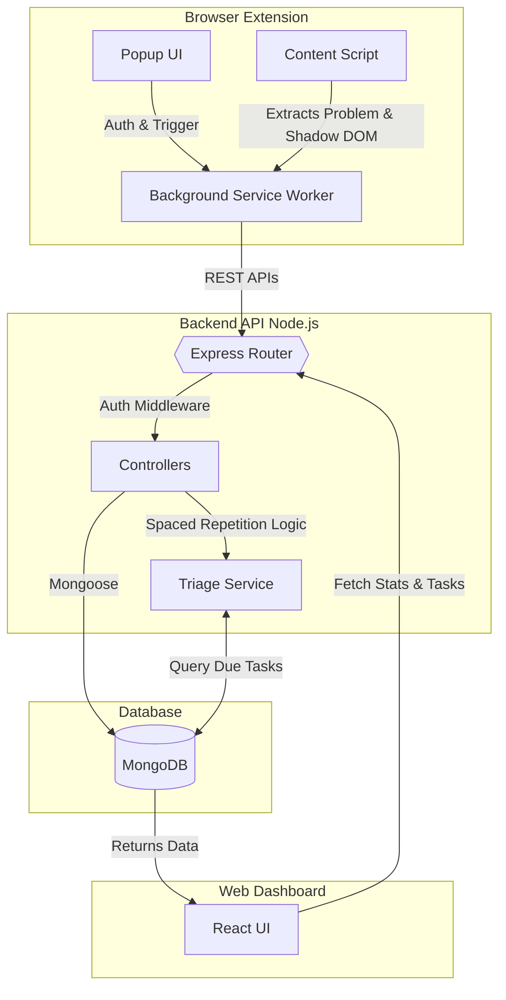

# 🏗️ DSAReps: System Architecture & Data Flow

This document details the underlying mechanics, algorithms, API contracts, and architectural decisions that power the DSAReps ecosystem.

## 🗺️ High-Level System Architecture



## 1. 🔌 Backend API & Data Flow

The backend acts as the central source of truth, handling OAuth, problem ingestion, and spaced-repetition calculations.

### Authentication & User

- `POST /api/auth/google` - Initiates Google OAuth flow.
- `GET /api/auth/google/callback` - OAuth callback returning a 30-day JWT.
- `GET /api/user/settings` - Fetches user preferences (daily caps, intervals).

### Problems & Spaced Repetition

- `POST /api/problems` - Captures a new problem from the extension. If the same URL was previously soft-deleted or archived, it is restored to active.
- `GET /api/problems` - Retrieves paginated problem history.
- `POST /api/problems/:id/revise` - Submits a rating (CLEAN, SLOW, FORGOT) and recalculates the stabilityScore and nextReviewDate.
- `PATCH /api/problems/:id/archive` - Archives mastered/irrelevant problems.
- `DELETE /api/problems/:id` - Soft-deletes a problem from active tracking (record remains in DB and can be restored by tracking the same URL again).

### Dashboard Analytics

- `GET /api/problems/stats` - Returns aggregated data for the UI:
  - 182-day heatmap contribution data
  - Difficulty mastery percentages
- `GET /api/problems/today` - Returns today's task queue (via Triage Service).

## 2. 🧩 Extension Architecture (Shadow DOM & State)

- **Popup Entry Point** (popup.js): Dynamically manages UI states (loading, auth, unsupported, form) based on the active tab's URL and current JWT validity.
- **Content Script & Shadow DOM** (contentScript.jsx): Creates Shadow DOM hosts to inject our "Save" button directly into LeetCode/Codeforces. This guarantees zero CSS conflicts with the host platform's styling.
- **Platform Detection** (platformConfigs.js): Uses specific regex and CSS selectors to extract problem slugs and titles cleanly from LeetCode, Codeforces, CSES, and GeeksForGeeks.
- **Stateful Background Sync**: The Service Worker manages daily digest alarms, updates the extension badge with due-task counts, and seamlessly recovers state if the browser goes idle.

## 3. 🧠 Spaced Repetition Engine & Triage Algorithm

### The Rating System & Math

The user's subjective feedback during a review acts as the input. The backend then recalculates their `stabilityScore` (0-100 mastery rating) and applies a deterministic interval rule to schedule the next review. A newly captured problem starts with a baseline `stabilityScore` of 30 and an initial interval taken from the user's difficulty settings.

- **User Input: FORGOT**
  - **Resulting State:** `FULL_RECODE` (`computeReviewType(stabilityScore)` after `RATING_RULES.FORGOT` resets the score below 40)
  - **Logic:** The user completely forgot the approach.
  - **Math:** Deterministic hard reset in `RATING_RULES.FORGOT`: `stabilityScore = 10`.
  - **Interval:** Deterministic reset in `RATING_RULES.FORGOT`: `currentIntervalDays = 1`.
- **User Input: SLOW**
  - **Resulting State:** `PATTERN_REBUILD` (`computeReviewType(stabilityScore)` when the adjusted score lands in the 40-69 band)
  - **Logic:** The user solved it, but struggled to recall the optimal pattern.
  - **Math:** Deterministic increase in `RATING_RULES.SLOW`: `stabilityScore = min(100, stabilityScore + 5)`.
  - **Interval:** `currentIntervalDays = min(90, max(1, Math.round(currentIntervalDays * 1.5)))` (for example, `2 -> 3`).
- **User Input: CLEAN**
  - **Resulting State:** `MICRO_RECALL` (`computeReviewType(stabilityScore)` when the adjusted score is 70 or higher)
  - **Logic:** Instant recognition and flawless execution.
  - **Math:** Deterministic increase in `RATING_RULES.CLEAN`: `stabilityScore = min(100, stabilityScore + 20)`.
  - **Interval:** `currentIntervalDays = min(90, max(1, Math.round(currentIntervalDays * 2.5)))` (for example, `1 -> 3`, `4 -> 10`).

### Daily Triage Service (`triage.service.js`)

When the dashboard requests today's tasks, the backend runs a 2-Phase selection:

- **Phase A (Manual Overrides)**: Priority 1. Fetches any problems the user explicitly pinned for today. Bypasses daily caps.
- **Phase B (Algorithmic Picks)**: Priority 2. Queries regular problems where `nextReviewDate <= today`. Fills remaining slots up to the user's daily cap, sorted by **lowest stability score first** (weakest problems surface first).

### Soft Delete and Restore Semantics

- Remove actions from extension/dashboard use soft delete (`isDeleted: true`) so accidental removals are reversible.
- Re-tracking the same URL does not create a duplicate record; the backend restores the existing problem to active state and returns a restore-aware response.
- Problem list queries exclude soft-deleted records and are sorted by latest update so restored items become visible immediately.

## 4. 🗄️ Core Database Schema (MongoDB)

The Problem collection is designed to track both metadata and spaced-repetition state:

```javascript
{
  userId: ObjectId,
  platform: String,       // 'leetcode', 'codeforces', etc.
  title: String,
  url: String,            // Unique identifier per user (enforced by compound unique index)
  difficulty: String,     // 'easy', 'medium', 'hard'
  notes: String,          // Markdown supported core-trick notes
  
  // Spaced Repetition Fields
  stabilityScore: Number, // 0-100 mastery rating
  lastAttemptRating: String, // 'FORGOT', 'SLOW', 'CLEAN'
  nextReviewType: String, // 'MICRO_RECALL', 'PATTERN_REBUILD', 'FULL_RECODE'
  currentIntervalDays: Number,
  nextReviewDate: Date,
  revisedCount: Number,
  lastRevised: Date,

  // Overrides
  isManualOverride: Boolean,
  manualOverrideDate: Date
}
```

### Indexes

- `({ userId: 1, url: 1 }, { unique: true, partialFilterExpression: { isDeleted: false } })`
  - Enforces one active/non-deleted problem per user URL.
  - Enables restore-on-retrack behavior: tracking the same URL again restores the existing document instead of creating a duplicate.
  - Duplicate-key conflicts are handled in the save flow so concurrent inserts return a safe duplicate response instead of leaving inconsistent state.

## 5. 🛡️ Security & Guardrails

- **Startup Safety**: Database connection is strictly required before the server starts listening (fail-fast behavior).
- **Granular Validation**: Daily review caps are strictly limited (1-10), and review intervals are capped (1-30 days). The system enforces an ordering rule where default intervals must be: Hard ≤ Medium ≤ Easy.
- **Timezone-Aware Streaks**: Streak calculations use timezone-based start-of-day math, preventing UTC-offset bugs where a user loses their streak despite doing the work in their local timezone.
- **Data Sovereignty**: Built-in JSON export allows users to download their full problem history and metadata at any time.

## 6. 🔔 Background Sync & Desktop Notifications

The extension utilizes a robust Chrome Manifest V3 Service Worker to deliver daily desktop notifications without draining background resources. It is designed to handle browser restarts, token expirations, and timezone shifts seamlessly.

### The Notification Lifecycle

1. **User Configuration:** When a user updates their notification time (e.g., 09:00 AM) in the dashboard, a `chrome.runtime.sendMessage` triggers the Service Worker.
2. **Alarm Scheduling:** The Service Worker clears old alarms and creates a new `chrome.alarms` listener. If 09:00 AM has already passed today, it accurately schedules the alarm for tomorrow at 09:00 AM, repeating every 1440 minutes.
3. **Execution (`fireDailyDigest`):** When the alarm fires, the system checks the user's JWT auth state. If valid, it fetches `/api/problems/today`.
4. **Anti-Spam Logic:** If the user has **0 problems due**, the system stays entirely silent. If problems are due, it triggers a native OS desktop notification: *"We've queued up X problems for you to review today."*
5. **Action:** Clicking the notification opens the dashboard and clears the OS tray.

### State Recovery & Edge Cases

Because Service Workers are routinely killed by the browser to save memory, the system employs aggressive state recovery:

| Situation | System Resolution |
| --- | --- |
| **Browser Restart (Service Worker killed)** | On startup, the extension fetches `/api/user/settings` and fully restores the alarm based on the DB state. |
| **User changes time from 09:00 to 20:00** | The active alarm is instantly cleared and rescheduled for 8:00 PM. |
| **Alarm fires, but 0 problems are due** | Fails gracefully and remains silent to avoid spamming the user on clean days. |
| **Alarm fires, but JWT token is expired** | The `isAuthenticated()` check fails, auth state is cleared, and the notification is silenced. |
| **Periodic Sync (Every 2 hours)** | A secondary alarm fires to update the extension badge accordingly. |

## 7. 📊 React Dashboard & Analytics Engine

The web client (`/dashboard`) is built with React, Vite, and Tailwind CSS, designed for heavy data visualization and a resilient user experience.

- **Contribution Heatmap (`ContributionHeatmap.jsx`):** A GitHub-style 182-day activity calendar. It dynamically calculates color intensity (5 levels of green) based on the user's daily revision count, alongside tracking "Longest Streak" and "Active Weeks".
- **Difficulty Mastery Clusters:** Calculates the user's objective mastery of Easy, Medium, and Hard problems by aggregating the average `stabilityScore` of all revised problems within that tier.
- **Offline Awareness UX:** If the user loses internet connection, the app displays an animated offline banner and degrades gracefully, caching recent states to prevent data loss.
- **Live Settings Sync:** Updating preferences (like the notification time) triggers an immediate background sync with the extension via API, avoiding polling delays.

## 8. 🔄 Complete Data Lifecycle & Sequence Flow

To understand how the decoupled components of DSAReps operate as a unified system, here is the complete sequence of a problem moving from initial capture to long-term memory retention.

### System Interaction Diagram

```mermaid
sequenceDiagram
  autonumber
  actor User
  participant Ext as Chrome Extension
  participant API as Node.js Backend
  participant DB as MongoDB
  participant Dash as React Dashboard

  Note over User,DB: Phase 1: Problem Capture
  User->>Ext: Solves "Two-Sum" & clicks "Save" (Hard)
  Ext->>API: POST /api/problems {title, difficulty, notes}
  API->>DB: Insert Problem (stability: 30, nextReview: +1 day)
  DB-->>API: Document Created
  API-->>Ext: 201 Created {problemId}
  Ext-->>User: Visual feedback (Blue Bookmark + Toast)

  Note over User,Dash: Phase 2: Daily Triage (Next Day)
  User->>Dash: Opens Dashboard
  Dash->>API: GET /api/problems/today
  API->>DB: Query: nextReviewDate <= today OR isManualOverride == true
  DB-->>API: Returns due tasks sorted by lowest stability
  API-->>Dash: Array of tasks (max daily cap)
  Dash-->>User: Displays "Today's Tasks" queue (Tagged: Full Recode from `computeReviewType(stabilityScore)`)

  Note over User,DB: Phase 3: Spaced Repetition Update
  User->>Dash: Re-solves problem & clicks "CLEAN" rating
  Dash->>API: POST /api/problems/{id}/revise { rating: 'CLEAN' }
  API->>API: Algorithm: `RATING_RULES.CLEAN` => `stabilityScore = min(100, score + 20)`; `currentIntervalDays = min(90, max(1, Math.round(interval * 2.5)))`
  API->>DB: Update (stability: 30 -> 50, nextReview: +3 days, rounded from 2.5)
  DB-->>API: Success (New RevisionLog entry created)
  API-->>Dash: Updated stats & newly calculated metrics
  Dash-->>User: UI Reacts: Heatmap cell updates, task removed from queue
```
